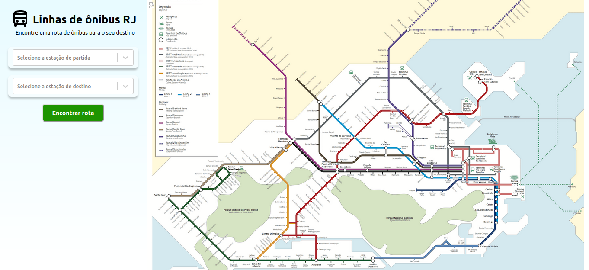
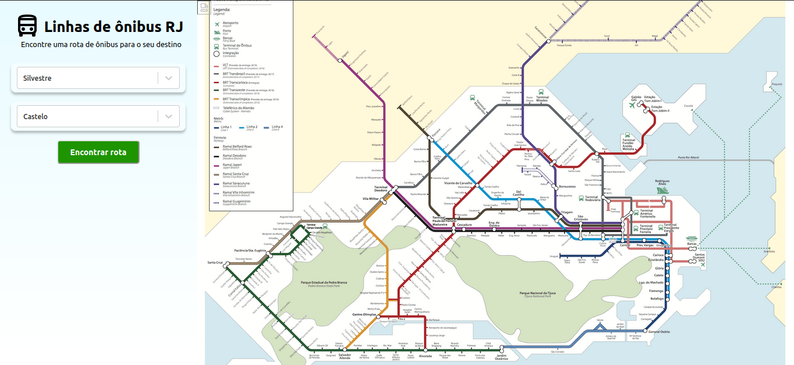
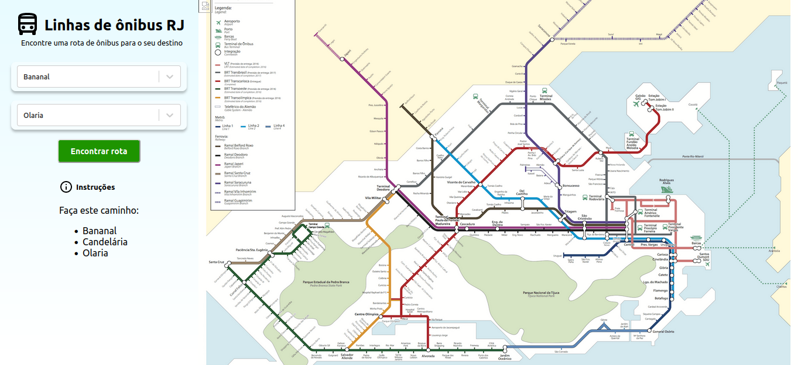

# Linhas de Ônibus

**Conteúdo da Disciplina**: Grafos 1<br>

## Alunos
|Matrícula | Aluno |
| -- | -- |
| 20/0023411  |  Luíza Esteves dos Santos |
| 20/0026551  |  Rafael Xavier Canabrava |

## Sobre 
Este projeto tem como objetico mostrar as melhores rotas de ônibus na cidade do Rio de Janeiro dada uma origem e um destino com base no algoritmo de busca em largura.

## Screenshots




## Instalação 
**Linguagem**: TypeScript<br>
**Framework**: React.js<br>

## Uso 
Para rodar o projeto você deve:
- Clonar o repositório
- Navegue até a pasta linha-onibus
- Execute os comandos:
 ```
  npm install
  npm start
```
- Em seu navegador, vá até [localhost:3000](http://localhost:3000)

## Outros 
Observação: nem todas as rotas do Rio de Janeiro estão disponíveis nessa aplicação.


